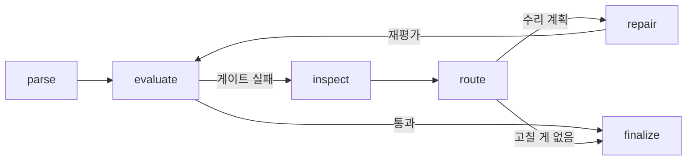

# parsing-agent

파싱한 결과를 스스로 채점하고, 뭐가 깨졌는지 진단해서, 고칠 가치가 있는 것만 골라 고치고, 고치다가 더 망가지면 되돌리는 PDF 파싱 파이프라인이다. LangGraph로 만들었고, 한국 환경영향평가 보고서(50~200페이지, 병합셀과 다중 페이지 표가 가득한 정부 문서)를 대상으로 개발했다.

시작은 단순했다. 기존 파서(opendataloader, PyMuPDF 계열)에 우리 문서를 넣어보니 표가 절반쯤 깨져 나왔다. 파서를 바꿔도 깨지는 위치만 달라졌다. 그래서 "어떤 파서를 쓰느냐"가 아니라 "파싱 결과가 깨졌다는 걸 어떻게 알고, 어떻게 고치느냐"를 문제로 잡았다.

## 동작 방식



한 라운드는 이렇게 돈다.

1. **parse** — 기본 파서로 마크다운 후보를 만든다. 파서가 죽으면 다음 파서로 폴백하고, 실패 내역은 `parse_errors`로 리포트에 남긴다.
2. **evaluate** — 결정적 메트릭(텍스트 커버리지, 유사도, 구조 보존, 표 보존)을 계산하고, LLM judge가 원본 PDF 페이지 이미지를 직접 보면서 채점한다. 총점이 게이트(기본 0.7)를 넘고 표 이슈가 없으면 여기서 끝.
3. **inspect** — 뭐가 깨졌는지 진단해서 수리 대상(RepairTarget) 목록을 만든다. 줄바꿈으로 잘린 문장, 중복 헤딩, 깨진 표, 누락된 본문 같은 것들.
4. **route** — 대상마다 어떤 전략으로 고칠지, 고칠 가치가 있는지(기대 이득 vs 비용) 정한다. 이미 시도했는데 점수가 안 오른 방법은 다시 쓰지 않는다.
5. **repair** — 계획을 실행하고 evaluate로 돌아간다. 최대 3라운드.

핵심은 5번 다음이다. 재평가 점수가 이전보다 **떨어지면** 그 수리를 버리고 최고 점수 후보로 되돌린다(`rollback_events`에 기록). 수리가 문서를 망치는 경우가 실제로 있는데, 이 롤백 덕분에 최종 결과가 수리 전보다 나빠지는 일은 구조적으로 불가능하다.

## 노드끼리 뭘 주고받나

처음엔 judge가 "표의 병합 셀 구조가 깨진 것 같습니다" 같은 **문장**을 내려주고, 다음 노드가 그 문장을 정규식으로 파싱해서 라우팅했다. LangSmith 트레이스를 열어보면 판단 근거가 전부 산문이었고, judge가 문장에 "반복"이라는 단어만 써도 엉뚱한 수리가 발동했다. 그래서 노드 간 계약을 전부 구조화된 값으로 바꿨다.

| 노드 | 내보내는 것 | 받는 쪽이 실제로 참조하는 필드 |
|---|---|---|
| parse | `candidate`, `parse_errors` | 후보 본문, 파서 이름 |
| evaluate | `metrics`, `best_candidate`, `rollback_events` | 점수(수치), `table_issues`(enum 목록), judge의 `table_findings`(taxonomy enum + 표 라벨 + 페이지 번호) |
| inspect | `repair_targets` | `issue_type`, `route_name`, `severity`, `confidence`, `repairability` — 전부 enum/수치 |
| route | `repair_plan` | `strategy`, `priority`, `expected_gain`, `estimated_cost`, `skip_reason` |
| repair | `repairs`, `attempted_repair_routes`, `failed_visual_task_keys`, `visual_repair_rejections` | 시도한 route 기록(무산된 시도 포함), 실패 사유 |

judge의 자유 문장(`issues`, `notes`)은 사람이 읽는 리포트에만 남고 기계 판단에는 쓰이지 않는다. 프롬프트에도 그렇게 명시했다: 수리가 필요한 문제는 반드시 taxonomy `issue_type`으로 `table_findings`에 넣어라, 문장으로만 언급된 문제는 무시된다. 트레이스 요약도 같은 원칙이라, LangSmith에서 route 노드를 열면 "왜 이 전략으로 분기했는지"가 enum과 숫자로 보인다.

## 수리 전략 3가지

비용 순서대로 쓴다.

- **휴리스틱** (무료) — 중복 줄 제거, 빈 줄 정리, 잘린 문장 병합. 한국어는 대소문자가 없어서 기존의 "다음 줄이 소문자로 시작하면 병합" 규칙이 안 먹힌다. 종결 어미(다/요/음/함/됨/임/것)로 문장 경계를 판정하는 규칙을 따로 만들었다.
- **LLM 텍스트 수리** — 휴리스틱으로 한 번 시도했는데 점수가 정체된 이슈는 LLM으로 승격된다. 문제 구간을 라인 윈도우로 잘라 원문 근거와 함께 보내고, 고친 텍스트를 받아 그 구간만 교체한다. confidence 임계값, 길이 비율 제한, "확신 없으면 changed=false로 반환" 가드레일이 있고, 본문 자체가 누락된 경우(커버리지 < 0.72)는 처음부터 LLM 전용 대상으로 잡힌다. 휴리스틱은 누락된 헤딩은 복구해도 누락된 본문은 못 만들기 때문이다.
- **비전 표 복구** — 깨진 표는 원본 PDF 페이지를 이미지로 잘라 vision 모델에 보내고 표를 재구성한다. 재구성된 표를 넣을 자리(원래 표 블록)가 아예 없는 경우 — 파서가 표를 그냥 줄글로 뱉은 경우인데 실제로 자주 있다 — 라벨이나 페이지 마커 뒤에 삽입하는 폴백을 탄다. 앵커를 못 찾으면 추측으로 삽입하지 않고 포기한다.

비전 복구는 거부되는 경우가 많아서(신뢰도 미달, 열 구조 검증 실패, 넣을 자리 없음, API 타임아웃) 거부 사유를 전부 리포트에 남긴다. 처음엔 이게 없어서 "왜 표가 안 고쳐졌지"를 알 방법이 없었다. 실문서 돌려보고 4개 태스크가 전부 조용히 실패한 걸 발견하고 나서 넣었다.

## 실측 결과

점수는 자체 메트릭(커버리지·유사도·구조·표 보존 가중합 + judge 블렌딩, 0~1)이다. 같은 문서에서 **파서 단발 출력(1라운드 점수) 대비 루프가 끝난 뒤 점수**를 비교하면 이 파이프라인이 더하는 가치가 그대로 보인다.

실제 그래프를 통째로 돌리는 검증 하네스 기준:

| 시나리오 | 파서 출력 | 루프 종료 | 비고 |
|---|---|---|---|
| 노이즈 문서 (중복 헤딩, 잘린 한국어 문장, 깨진 표) | 0.862 | **0.981** | 휴리스틱 3종, 전부 검증 통과 |
| 본문 절반 누락 | 0.406 | **0.930** | 휴리스틱이 구조 복구 → LLM이 본문 복원, 1라운드 |
| 일부러 망가뜨리는 수리기 주입 | 0.862 | **0.862** | 0.0까지 떨어진 결과를 롤백이 차단 |

실제 환경영향평가 협의문서(관인·표 포함)로는 0.768 → 0.795, 이 과정에서 후반 라운드 미세 악화를 롤백이 두 번 잡았다. 극적인 숫자는 아니지만, 이 문서의 남은 문제(다중 페이지 병합셀 표)가 어느 게이트에서 왜 거부됐는지가 리포트에 전부 남는다는 게 중요하다.

marker나 docling, unstructured 같은 도구들과의 정량 비교는 아직 안 했다. 공정하게 하려면 같은 문서셋에 같은 채점 기준을 적용해야 하는데, 우리 메트릭으로 채점하면 우리한테 유리한 심판을 세우는 거라 의미가 없다. 대신 구조적인 차이는 분명하다: 그 도구들은 전부 단발 변환이다. 출력이 깨졌는지 스스로 확인하지 않고, 고치지도 않고, 왜 깨졌는지도 말해주지 않는다. 이 파이프라인은 그 도구들을 파서 어댑터로 안에 품을 수 있는 구조라서, 경쟁 관계라기보다 그 위에 얹는 품질 루프에 가깝다. 사람 라벨링 골든셋과 TEDS 계열 표 메트릭으로 제대로 된 벤치마크를 만드는 게 다음 단계다.

## 신뢰성 관련해서 신경 쓴 것들

외부 API가 끼어 있는 파이프라인은 API가 죽을 때 같이 죽으면 안 된다.

- judge 호출: 지수 백오프 재시도, 코드펜스/산문에 섞인 JSON도 파싱하는 폴백, 그래도 실패하면 judge 없이 결정적 메트릭만으로 진행 (fail-open, 끌 수도 있음)
- 파서 크래시: 다음 어댑터로 폴백, 전부 실패해야 에러
- 비전 수리: 표 하나 실패가 나머지 표 수리를 막지 않게 청크 단위로 예외 격리
- 같은 표를 같은 이슈로 무한 재시도하지 않게 실패 키 추적, 액션이 안 나온 무산 시도도 "시도함"으로 기록

테스트는 175개. 유닛 테스트만 믿지 않고 실제 LangGraph를 열화 문서로 돌리는 E2E 하네스를 따로 두는데, 이게 유닛 테스트가 전부 통과하는 상태에서 배선 버그 3개를 잡아냈다(externalize된 원문이 특정 노드에서 복원 안 되던 것, 무산된 수리가 시도 기록에 안 남아 승격이 영영 안 되던 것, 누락 본문에 수리 대상 자체가 안 생기던 것). 셋 다 회귀 테스트로 고정했다.

## 스택 / 실행

Python 3.12, LangGraph, LangSmith(트레이싱), OpenAI 호환 API(judge·텍스트 수리·비전), PyMuPDF, Surya OCR, pytest, uv.

```bash
uv sync
export OPENAI_API_KEY=sk-...   # 없으면 judge/LLM 수리 없이 결정적 메트릭만으로 동작

uv run python -m parsing_agent.cli "문서.pdf" --output-dir outputs/run-1
uv run pytest   # 175개, 1초 미만
```

문서마다 수리된 마크다운과 JSON 리포트가 나온다. 리포트에는 라운드별 점수 궤적, 진단된 이슈, 수리 계획과 스킵 사유, 검증 결과, 롤백 이벤트, 비전 수리 거부 사유까지 의사결정 전체가 남는다. 설정은 전부 `PARSING_AGENT_*` 환경변수로 조정한다 (`config.py` 참고).

## 아직 안 된 것

- 사람이 라벨링한 골든셋이 없다. 지금 점수는 전부 자체 메트릭 + LLM judge라, 사람 기준과 얼마나 맞는지 검증이 안 됐다. 이게 제일 큰 빚이다.
- 표 메트릭이 열 개수 일관성 수준이다. TEDS처럼 셀 단위 구조를 보는 메트릭이 필요하다.
- 다중 페이지 병합셀 표는 비전 복구도 자주 실패한다. crop 전략을 손봐야 한다.
