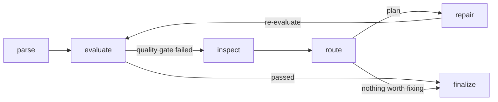

# parsing-agent — Self-Healing Document Parsing Workflow

An agentic PDF-parsing pipeline that **evaluates its own output, diagnoses what went wrong, picks the cheapest repair strategy that can fix it, and rolls back anything that makes the result worse** — built with LangGraph and battle-tested on real-world Korean environmental impact assessment reports (50–200 page government documents full of multi-page tables, merged cells, and scanned figures).

This is not a "call an LLM on a PDF" wrapper. It is a production-hardened quality loop: deterministic metrics + a multimodal LLM judge decide *whether* output is good enough, a router decides *which* of three repair strategies is worth the cost, and every decision travels between graph nodes as structured data — never as free-text prose.



## Why it's interesting

**Three repair strategies, cost-aware routing.** Cheap regex heuristics run first (deduplication, blank-line collapse, Korean-aware wrapped-line merging). If a route stalls — same issue, no score improvement — the router *escalates* that specific issue to a **targeted LLM repair**: the defect is located as a line window, sent to the model with source evidence, and patched under guardrails (confidence threshold, length-ratio bounds, "return unchanged if unsure"). Broken tables go to a **vision model** that reads the original PDF page image and reconstructs the table, with anchor-based insertion fallback when the parser never produced a table block to replace.

**Self-verification with rollback.** Every repair is re-scored. If a repair round regresses the total score, the workflow restores the best-scoring candidate and records a `rollback_event` — a broken repair can never ship. In live runs against real documents this fires exactly when it should (e.g., trajectory `0.768 → 0.795 → 0.786(rolled back) → 0.795`).

**LLM-as-judge with multimodal grounding.** The judge sees rendered PDF page images plus stratified text evidence (including context windows around every table label), returns machine-readable findings against a fixed issue taxonomy, and is *fail-open*: retries with exponential backoff, JSON extraction fallbacks for fenced/prose-wrapped responses, and graceful degradation to deterministic metrics if the API is down. A judge outage degrades quality signals — it never crashes a parse.

**Structured node contracts.** Routing decisions depend only on enums and numbers (`issue_type`, `route_name`, `severity`, `confidence`), never on parsing the judge's prose. LangSmith traces export decision-relevant structured summaries (which issues, which strategy, expected gain, skip reason) instead of opaque counts or leaked document text.

**Every rejection is explainable.** When a vision-based table recovery is discarded, the reason lands in the report: `low_confidence (0.2)`, `sanity_check_failed`, `patch_target_not_found`, `recover_exception: TimeoutError`. No silent failures.

## Verified behavior (not just claimed)

The test suite (**175 tests**) pins the contracts, and a graph-level E2E harness runs the *real* LangGraph against degraded documents:

| Scenario | Result |
|---|---|
| Noisy parse (duplicate headings, wrapped Korean sentences, broken table) | `0.862 → 0.981`, all repairs pass verification |
| Half the document missing | `0.406 → 0.930` in one round — heuristics restore structure, LLM repair restores body content from source evidence |
| Deliberately destructive repairer | Regression detected, **rollback restores the original**, failure reason recorded |

The E2E harness caught three real wiring bugs that unit tests missed (externalized state not materialized in two nodes, no-op repairs never marked as "attempted" so escalation could not fire, missing body content having no repair target at all) — each is now a regression test.

## Engineering highlights

- **Resilience by default** — parser fallback chain (a crashing parser falls through to the next adapter), per-chunk exception isolation for parallel table repairs, bounded repair rounds, failed-task keys that prevent retrying the same broken repair.
- **CJK-aware text processing** — wrapped-line merging that understands Korean sentence-terminal endings (다/요/음/함/됨/임/것), Korean table-label matching (`표 4.2-2` and unnumbered labels like `사후환경영향조사계획 표`), NFC normalization.
- **Honest evaluation** — deterministic metrics include a table *structure* consistency score (modal column-count agreement per table), so a table that kept its label but lost half its columns can no longer hide behind label matching.
- **Cost control** — expected-gain vs. estimated-cost gating per repair step (first round always runs; re-rounds must justify spend), per-round caps on LLM/vision calls, evidence-size budgets for judge grounding.
- **Clean history** — conventional commits, each landing with its tests green.

## Architecture

| Component | Role |
|---|---|
| `workflow.py` | LangGraph state machine: parse → evaluate → inspect → route → repair loop → finalize; rollback, attempt tracking, trace summaries |
| `evaluation.py` | Deterministic metrics (coverage, similarity, structure, table preservation + structure consistency), judge integration, issue classification against a fixed taxonomy |
| `judge.py` | OpenAI-compatible multimodal judge: PDF page grounding, stratified evidence, retry/backoff, JSON fallbacks |
| `repair.py` | Heuristic repair directives, repair-target diagnosis, vision-repair task planning/application with rejection logging |
| `llm_repair.py` | Issue-level targeted LLM text repair: window location, evidence-grounded patching, guardrails |
| `visual_repair.py` | Vision-model table reconstruction from PDF page crops, table block replacement + anchor-insertion fallback |
| `ocr.py` / `parsers.py` | Surya OCR integration; parser adapters (layout-first PDF, opendataloader, text fallback) behind a registry |

## Quick start

```bash
uv sync
export OPENAI_API_KEY=sk-...   # judge + LLM/vision repair (optional — degrades gracefully without it)

uv run python -m parsing_agent.cli "path/to/document.pdf" --output-dir outputs/run-1
uv run pytest                   # 175 tests, <1s
```

Output per document: repaired Markdown, plus a JSON report containing the full decision trail — score trajectory per repair round, diagnosed issues, the repair plan with skip reasons, verified repair outcomes, rollback events, and visual-repair rejection reasons.

Everything is tunable via `PARSING_AGENT_*` environment variables (judge model/evidence budgets, repair round limits, LLM-repair confidence thresholds, vision recovery caps) — see `config.py`.

## Stack

Python 3.12 · LangGraph · LangSmith tracing · OpenAI-compatible APIs (text + vision) · PyMuPDF · Surya OCR · pytest · uv

## Roadmap

- Golden dataset (human-labeled) + judge calibration against human scores
- TEDS-style table structure metric on top of the consistency score
- CI regression gates on a fixed document set
