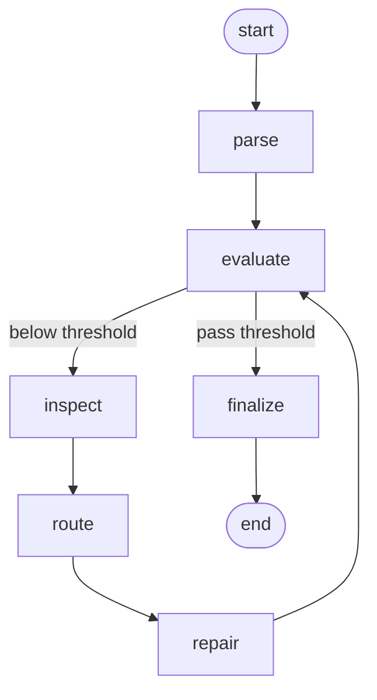

# Agentic Workflow Redesign PRD

## Goal

현재 파싱 워크플로우를 `다중 보조 개념이 섞인 그래프`에서 `단일 parser 기반 evaluate/repair loop`로 단순화한다.

목표 워크플로우는 아래 5개 노드와 종료 경로만 가진다.

1. `parse`
2. `evaluate`
3. `inspect`
4. `route`
5. `repair`
6. `finalize`

상위 LangGraph는 이 루프만 표현해야 한다.



## Background

현재 구현은 단일 candidate 루프에 가까워졌지만, 상위 그래프와 노드 책임이 아직 아래처럼 과하다.

- `triage_document`가 parser 선택을 별도 노드에서 수행
- `parse_document`가 parse 외에 support metadata, table slot, cache externalization까지 수행
- `verify_candidate`가 별도 노드로 존재
- `repair_candidate` 외에 `repair_chunk`, `merge_repair_chunks`가 상위 그래프에 노출
- `finalize_result`가 enrichment와 재평가를 수행
- `summarize_result`가 별도 종료 노드로 존재

이 구조는 사용자가 원하는 “기본 parser 결과를 계속 평가하고, 원인별로 고치고, 다시 평가하는 루프”보다 복잡하다.

## Product Requirements

### R1. 상위 그래프 단순화

LangGraph 상위 노드는 아래만 남긴다.

- `parse`
- `evaluate`
- `inspect`
- `route`
- `repair`
- `finalize`

삭제 대상:

- `triage_document`
- `verify_candidate`
- `repair_chunk`
- `merge_repair_chunks`
- `summarize_result`

삭제의 의미는 “상위 그래프 노드에서 제거”다. 내부 helper 재사용은 허용한다.

### R2. parse 책임

`parse`는 기본 parser 1개만 실행한다.

허용:

- `config.parser_names[0]` 사용
- parser adapter 재사용
- base candidate 선택을 위한 최소 유효성 확인

비허용:

- multi-parser selection
- support parser metadata 결합
- triage 기반 parser 변경
- parse 단계에서 table slot 주입

### R3. evaluate 책임

`evaluate`는 점수 계산만 수행한다.

허용:

- deterministic evaluator 재사용
- optional judge 재사용
- accuracy snapshot 기록

비허용:

- candidate 교체
- repair 적용
- finalize enrichment

### R4. inspect 책임

`inspect`는 품질이 낮은 영역과 원인을 식별한다.

산출물 예시:

- `text_wrap`
- `duplicate_heading`
- `blank_line_noise`
- `table_structure`
- `missing_figure`

기존 `identify_repair_targets(...)`는 재사용 가능하다.

### R5. route 책임

`route`는 품질 이슈를 실제 repair 전략으로 매핑한다.

예시:

- `text_wrap -> merge_wrapped_lines`
- `duplicate_heading -> deduplicate_headings`
- `table_structure -> recover_tables_from_pdf_image`
- `missing_figure -> leave_as_is` 또는 future route

이 노드는 `repair_targets`를 입력으로 받아 `repair_plan`을 만든다.

### R6. repair 책임

`repair`는 `repair_plan`에 따라 실제 수정을 수행한다.

중요:

- 상위 그래프에서는 repair 노드를 하나만 유지한다.
- 표 복구가 필요하더라도 `repair_chunk`, `merge_repair_chunks`를 상위 그래프에 노출하지 않는다.
- 필요하면 내부 helper로 chunk planning / patch merge를 호출한다.

즉:

- 상위 그래프: `repair`
- 내부 구현: heuristic repair, visual table repair helper 재사용 가능

### R7. finalize 책임

`finalize`는 최종 결과만 산출한다.

허용:

- `WorkflowResult` 조립
- summary 생성
- artifacts/report 작성에 필요한 데이터 조립

비허용:

- image caption enrichment
- candidate content 수정
- 재평가

### R8. loop 조건

루프 조건은 단순해야 한다.

- `metrics`가 품질 기준 미만이면 repair loop 진입
- `iteration_count >= max_repair_rounds`이면 종료
- `inspect -> route -> repair`는 항상 강제 경로다
- repair target이나 repair plan이 비어 있어도 `repair -> evaluate`는 수행한다
- 실제 수정이 없더라도 iteration count는 증가해야 한다

## Non-Goals

이번 재설계에서 하지 않을 것:

- block-level parser routing 전체 재구현
- support parser를 활용한 multi-source merge
- layout-first parser 제거
- evaluator metric 공식 변경
- visual repair 알고리즘 자체 교체

## Reuse Plan

기존 코드 중 재사용할 대상:

- parser adapter / registry
- `DeterministicEvaluator`
- optional LLM judge
- `identify_repair_targets(...)`
- `HeuristicRepairer.repair_heuristics(...)`
- visual table repair helper
- report writer / CLI output

재사용하되 상위 그래프에서 감출 대상:

- table patch merge helper
- chunk repair planning helper
- source/candidate cache helper

## Proposed State Model

최소 상태는 아래로 줄인다.

```python
WorkflowState = {
  source,
  candidate,
  metrics,
  repair_targets,
  repair_plan,
  repairs,
  iteration_count,
  accuracy_snapshots,
  result,
}
```

제거 또는 축소 대상:

- `triage_decision`
- `selected_parser_names`
- `pending_candidate`
- `pending_actions`
- `repair_tasks`
- `repair_task_results`

필요하면 `repair_plan`만 유지하고 내부 helper에서 로컬 변수로 처리한다.

## Proposed Node Contracts

### parse

입력:

- `source`

출력:

- `candidate`
- `repairs=[]`
- `iteration_count=0`
- `accuracy_snapshots=[]`

### evaluate

입력:

- `source`
- `candidate`

출력:

- `metrics`
- `accuracy_snapshots += current evaluation`

### inspect

입력:

- `source`
- `candidate`
- `metrics`

출력:

- `repair_targets`

### route

입력:

- `repair_targets`

출력:

- `repair_plan`

### repair

입력:

- `source`
- `candidate`
- `metrics`
- `repair_plan`

출력:

- `candidate`
- `repairs += applied actions`
- `iteration_count += 1`

### finalize

입력:

- `source`
- `candidate`
- `metrics`
- `repairs`

출력:

- `result`

## Implementation Plan

### Phase 1. Graph reshape

- `workflow.py` graph를 새 6노드 구조로 변경
- graph export 테스트 갱신

### Phase 2. Node responsibility cleanup

- `parse_document`에서 triage/support merge/table slot 주입 제거
- `evaluate_candidate`에서 pending candidate 승격 로직 제거
- `finalize_output`에서 enrichment/re-evaluate 제거

### Phase 3. Internal repair consolidation

- `repair_chunk`, `merge_repair_chunks` 상위 노드 제거
- 내부 helper로만 재사용하거나 `repair_candidate` 내부로 흡수

### Phase 4. Tests

반드시 갱신할 테스트:

- graph export tests
- evaluate/repair loop tests
- repair routing tests
- finalize behavior tests

## Acceptance Criteria

아래가 모두 만족되면 완료로 본다.

1. LangGraph mermaid 출력에 아래 노드만 보인다.
   - `parse`
   - `evaluate`
   - `inspect`
   - `route`
   - `repair`
   - `finalize`

2. `parse_document`는 기본 parser 1개만 실행한다.

3. `finalize_output`은 candidate를 수정하지 않고, 재평가도 수행하지 않는다.

4. 품질 미달 문서는 `evaluate -> inspect -> route -> repair -> evaluate` 루프를 탄다.

5. 기존 핵심 테스트와 새 구조 테스트가 통과한다.

## Risks

- 현재 table slot/support metadata가 일부 PDF repair 정확도에 실제로 기여하고 있을 수 있다.
- 이 로직을 parse 단계에서 제거하면 일부 표 복구 품질이 떨어질 수 있다.
- 따라서 1차 재설계는 “상위 그래프 단순화”를 우선하고, 내부 helper 재사용은 허용한다.

## Open Decisions Requiring User Confirmation

아래 두 가지는 확인이 필요하다.

1. `triage_document`를 완전히 제거할지
   - 제안: 제거

2. `finalize_output`에서 summary 생성은 허용할지
   - 제안: 허용
   - 이유: 결과 산출의 일부이고 candidate 자체를 수정하지 않음
